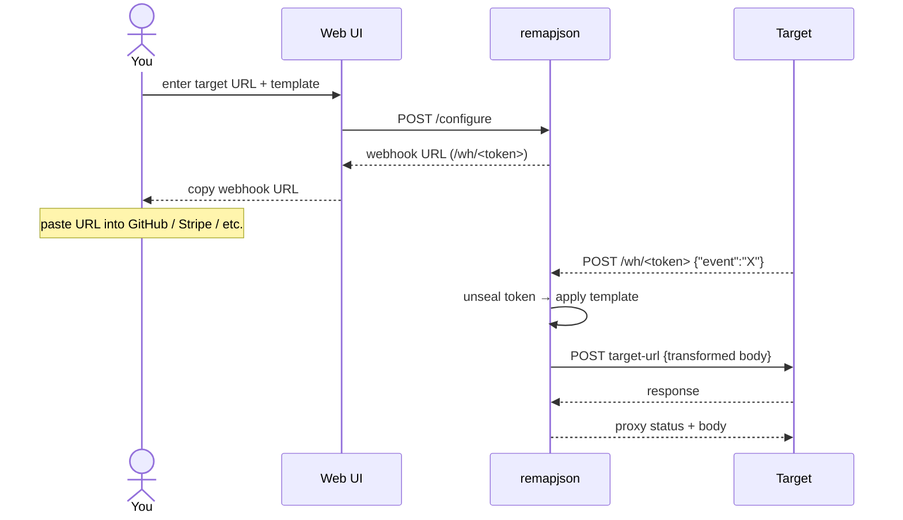
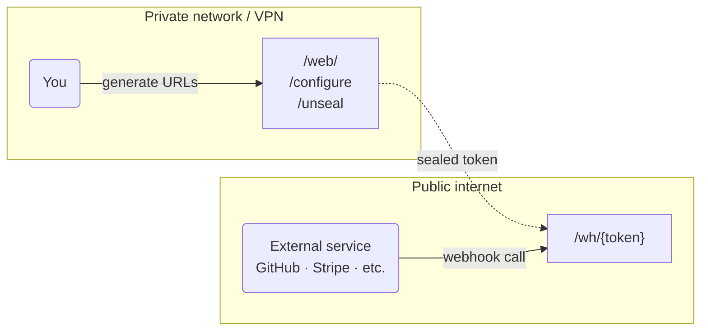
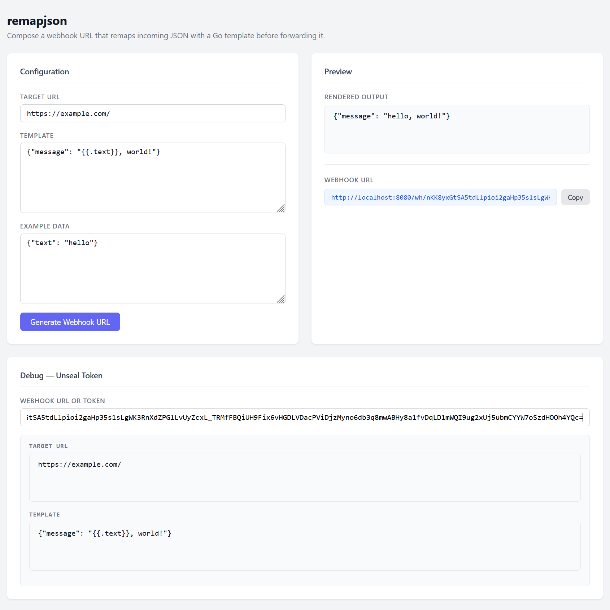
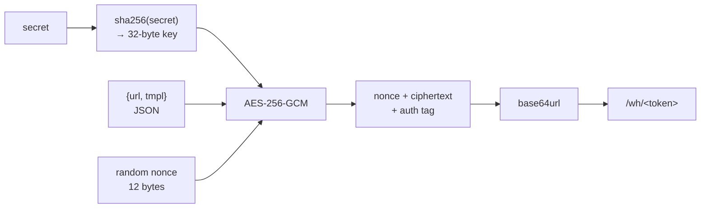

# remapjson

[](https://github.com/Semior001/remapjson/actions/workflows/.go.yaml)&nbsp;[](https://goreportcard.com/report/github.com/Semior001/remapjson)&nbsp;[](https://github.com/Semior001/remapjson/releases)&nbsp;[](https://codecov.io/github/Semior001/remapjson)

remapjson is a stateless webhook adapter. It sits in front of any HTTP endpoint and transforms incoming JSON payloads using Go templates before forwarding the request. The transformation rule (target URL + template) is sealed with AES-GCM and encoded into the webhook URL itself — so there is no database, no configuration files, and no state to keep in sync.

---

- [how it works](#how-it-works)
- [deployment model](#deployment-model)
- [installation](#installation)
- [usage](#usage)
- [templates](#templates)
  - [example: Slack → custom webhook](#example-slack--custom-webhook)
  - [empty body](#empty-body)
- [security](#security)

---

## how it works



1. You open the web UI, enter the **target URL** and a **Go template**.
2. remapjson encrypts both with AES-256-GCM using the server secret and returns an opaque webhook URL.
3. You paste that URL into the service that will call it (GitHub, Stripe, etc.).
4. When a request arrives, remapjson decrypts the token, applies the template to the JSON body, and forwards the result to the target URL.

No routing tables, no config reloads. Each webhook URL is self-contained.

## deployment model



- The **web UI** and `/configure` endpoint live behind your private network or VPN. Only you generate webhook URLs.
- The **`/wh/{token}`** route is exposed to the internet and accepts calls from external services.
- Because all configuration is sealed inside the token, the public endpoint cannot be abused to forward to arbitrary targets or use arbitrary templates — it will reject anything not signed by the server secret.

## installation

**Go:**
```shell
go install github.com/Semior001/remapjson@latest
```

**Docker:**
```shell
docker pull ghcr.io/semior001/remapjson:latest
```

## usage

```
Usage:
  remapjson [OPTIONS] <command>

Global options:
      --json   Enable JSON logging [$JSON]
      --debug  Enable debug mode [$DEBUG]

Commands:
  version  Print application version and build date
  server   Run the HTTP server

server options:
  --addr=      Address to listen on (default: :8080) [$ADDR]
  --base-url=  Public base URL, used to build webhook URLs (required) [$BASE_URL]
  --secret=    Secret used to seal webhook configurations (required) [$SECRET]
  --password=  Password for Basic Auth on the web UI (optional) [$PASSWORD]
  --timeout=   HTTP client timeout for outbound requests (default: 90s) [$TIMEOUT]

Help Options:
  -h, --help   Show this help message
```

**Minimal example:**
```shell
remapjson server \
  --base-url=https://hooks.example.com \
  --secret="$(openssl rand -hex 32)"
```

**Docker Compose:**
```yaml
services:
  remapjson:
    image: ghcr.io/semior001/remapjson:latest
    environment:
      BASE_URL: "https://hooks.example.com"
      SECRET: "your-random-secret-here"
    ports:
      - "8080:8080"
```

After startup, open `http://localhost:8080/web/` in your browser to generate webhook URLs.



## templates

Templates use Go's [`text/template`](https://pkg.go.dev/text/template) package. The incoming JSON body is parsed into a `map[string]any` and passed as the template data (`.`). Fields are accessed with dot notation.

**Accessing fields:**
```
{{.fieldName}}
{{.nested.field}}
```

**Conditional content:**
```
{{if .isPremium}}premium{{else}}free{{end}}
```

**Iteration:**
```
{{range .items}}{{.name}}, {{end}}
```

**Building a JSON payload from scratch:**
```json
{"text": "{{.actor}} pushed {{len .commits}} commit(s) to {{.repository.name}}"}
```

The rendered output of the template is sent verbatim as the body of the forwarded request.

### example: Slack → custom webhook

Suppose GitHub sends a push event and you want to post a Slack message to your own webhook:

**Incoming JSON (from GitHub):**
```json
{
  "ref": "refs/heads/main",
  "pusher": {"name": "alice"},
  "commits": [{"message": "fix: typo"}, {"message": "feat: new endpoint"}]
}
```

**Template:**
```
{"text": "{{.pusher.name}} pushed {{len .commits}} commit(s) to {{.repository.full_name}}"}
```

**Forwarded body:**
```json
{"text": "alice pushed 2 commit(s) to acme/backend"}
```

### empty body

If the incoming request has no body (e.g. a ping from a monitoring system), the template data is `nil`. Templates that produce static output work fine:

```
{"event": "ping", "ok": true}
```

Accessing `.field` on a nil map renders an empty string rather than erroring.

## security

### sealed tokens (AES-256-GCM)

The target URL and template are never stored anywhere. Instead they are encrypted together using AES-256-GCM before being embedded in the webhook URL path:



**What this means in practice:**
- Each call to `/configure` produces a different token, even for the same URL and template (random nonce).
- An attacker who can observe webhook URLs cannot recover the target URL or template.
- A token generated with a different secret is rejected — the GCM authentication tag check fails before any outbound request is made.
- The `/wh/{token}` endpoint cannot be used to proxy to arbitrary targets; only URLs sealed by the server's own secret are accepted.

### rate limiting and size limits

- Global rate limit: **10 requests/second** (applied across all routes).
- Maximum request body: **1 MB**.
- HTTP client timeout for outbound requests: **90 seconds** (configurable via `--timeout`).

### secret management

- Use a secret of at least 32 bytes of random data. `openssl rand -hex 32` generates a suitable value.
- Rotate the secret when you suspect it may be compromised. All previously issued webhook URLs will become invalid and need to be regenerated through the web UI.
- Pass the secret via the `SECRET` environment variable rather than a CLI flag to avoid it appearing in process listings.

### web UI access

The web UI and management endpoints are protected with HTTP Basic Auth when `--password` is set. 

Additionally, if you need to expose the webhook endpoint outside of the private perimeter, place remapjson behind a reverse proxy and **expose only** `/wh/{token}` publicly.

Example Caddy snippet:
```
hooks.example.com {
    # Public webhook receiver
    handle /wh/* {
        reverse_proxy localhost:8080
    }

    # Internal UI — restrict by source IP
    handle {
        @internal remote_ip 10.0.0.0/8 192.168.0.0/16
        handle @internal {
            reverse_proxy localhost:8080
        }
        respond 403
    }
}
```
